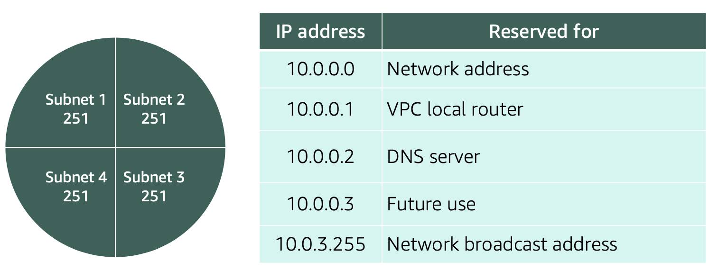
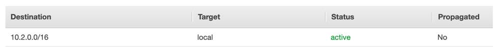
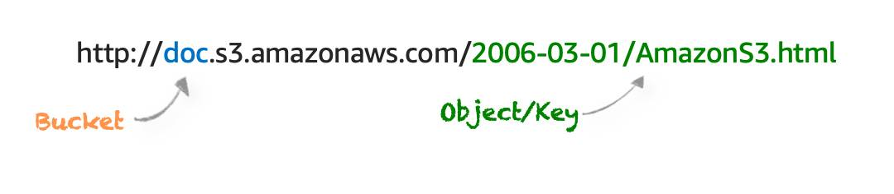

# AWS

#### Latency refers to the time delay it takes for data to travel from one point to another across a network.

## 1. Amazon API Gateway

is a service offered by Amazon Web Services (AWS) that simplifies the process of creating, publishing, maintaining, monitoring, and securing APIs at any scale [1]. An API, or Application Programming Interface, acts as a middleman between applications and backend services. It essentially provides a way for applications to access data, functionality, or business logic from backend resources.

### Here are some of the key features of API Gateway:

1. Supports multiple API types: Create `RESTful APIs`, which are a popular architectural style for APIs, or `WebSocket APIs`, which enable real-time two-way communication between applications.
2. Acts as a front door: API Gateway centralizes access to your backend services, such as those running on EC2 instances, Lambda functions, or web applications.
3. Manages API traffic: API Gateway handles many of the heavy lifting tasks associated with APIs, including traffic management, security features like authorization and access control, throttling to prevent overload, monitoring, and API version management.
4. Cost-effective: There are no minimum fees or startup costs to use API Gateway. You are only charged for the API calls you receive and the data transferred.

If you're looking to build APIs for your own applications or open them up to third-party developers, AWS API Gateway is a powerful tool that can streamline the process.

## 2. An Avaibility Zone

is a geographically separate location within an AWS Region. These zones are isolated from each other to ensure an outage in one zone doesn't disrupt others. Each AZ consists of one or more data centers with redundant power, networking, and physical separation. Imagine them as mini-regions within a larger AWS Region.

### Benefits:

1. Enhanced Fault Tolerance: If an AZ experiences a power outage or hardware failure, your application can seamlessly continue functioning in another zone.
2. Reduced Latency: Since AZs are geographically close within a region, resources in different zones enjoy low-latency network connections. This is crucial for real-time applications.
3. Scalability Made Easy: Scaling your applications up or down becomes effortless by provisioning resources across multiple AZs. Need more compute power? Add resources in another zone!

   In essence, AZs are the foundation for building robust and fault-tolerant applications on AWS.

## 3. REGION

IF AZ goes down, using redundancy like data centeres, AWS also clusters AZs together. and also connects them with redundant
high speed and low latency links. A cluster of AZs is called Region.

#####################################################################################

## WAYS TO INTERACT WITH AWS

1. AWS Management console
2. AWS CLI
3. SDK

###################################################################################

# AWS IDENTITY & ACCESS Control and Credential management

## IAM

All API calls in AWS must be signed and authenticated in order to be allowed; no matter if the resources live in the same account or not. Application code running on the EC2 instance nneds access to credentials to make this signed call to S3.IAM does that.

### Aplication lvl Managment(authenticating users into the application itself) is not managed by IAM

### IAM handles access to AWS account and READ/WRITE between different AWS services.

### Authentication:You are who you say you are

IAM users take care of authentication

### Authorization: Are you autherized to launch this task.

you can take care of authorization by attatching IAM policies to users in order to grant or deny permissions to take actions. IAM policies are json based docs

## ROLE BASED IAM USERS: to handle signed API calls between resouces.

# IAM policy

{

"Version": "2012-10-17",

     "Statement": [{
          "Effect": "Allow",

          "Action": "*",

          "Resource": "*"

     }]

}

In this policy, there are four major JSON elements: Version, Effect, Action, and Resource.

The Version element defines the version of the policy language. It specifies the language syntax rules that are needed by AWS to process a policy. To use all the available policy features, include "Version": "2012-10-17" before the "Statement" element in all your policies.

The Effect element specifies whether the statement will allow or deny access. In this policy, the Effect is "Allow", which means you’re providing access to a particular resource.

The Action element describes the type of action that should be allowed or denied. In the above policy, the action is "\*". This is called a wildcard, and it is used to symbolize every action inside your AWS account.

The Resource element specifies the object or objects that the policy statement covers. In the policy example above, the resource is also the wildcard "\*". This represents all resources inside your AWS console.

### IAM users have associated credentials like an access key ID and secret access key that re used to sign requests.

## ROLE BASED ACCESS IN AWS:

Policies can be assigned to users and group to assign permissions.
An IAM role is an identity that can be assumed by someone/something who needs temp access to AWS credentials.

### so how does the process of signing API calls work

### IAM roles handle this signing process. IAM roles are identities in AWS that like an IAM user also have asssociated AWS credentials used to sign requests.

### IAM users have usernames & password as well as static credentials.IAM ROLES don't have static one. Credentials are programmmatic, temporary and automatically rotated. EC2 instance will be assigned an IAM role which will help app runnning on it get access to S3.

### External Identity providers can also assume IAM role

# W-EE-K 2

## VPC: Virtual Private Cloud

Imagine you have your own little apartment in a giant apartment building, that's kind of like a VPC in AWS. VPC stands for Virtual Private Cloud. It's a private network you create within the AWS cloud, separate from the public internet.

Here's why VPCs are useful:

1. Security: They keep your resources, like virtual machines, isolated from others in the cloud. Think of your apartment building having its own security system, keeping things safe and sound.

2. Control: You have control over who can access your resources. It's like having your own keys to your apartment, deciding who can visit.

3. Flexibility: You can customize your network within the VPC, like adding different rooms (subnets) for different purposes in your apartment.

So, VPCs provide a secure and customizable space for your AWS resources, just like your own little apartment in the cloud!

### VPC (Virtual Private Cloud) in AWS is a virtual network dedicated to your AWS account. It allows you to define a virtual network topology, including subnets, route tables, and gateways, that is logically isolated from other virtual networks in the AWS Cloud.

## Containers.

### In container everything is just packaged up in a single executable, container itself.

### container orchestration: Managing multiple containers.

Amazon container orchestration tools:

1. Amazon Elastic container service
2. Amazon Kubernetes service
3. AWS Fargate

### AWS Fargate: sreverless compute platform for ECS or EKS

is a technology that allows you to run containers without managing servers or clusters of Amazon EC2 instances ¹. It provides on-demand, right-sized compute capacity for containers, and you don't have to provision, configure, or scale groups of virtual machines on your own to run containers ². Here are some key points about AWS Fargate ³:

## ORCHESTRATE CONTAINERS

In AWS, containers run on EC2 instances. For example, you may have a large instance and run a few containers on that instance.While running one instance is easy to manage, it lacks high availability and scalability. Most companies and organizations run many containers on many EC2 instances across several Availability Zones.If you’re trying to manage your compute at a large scale, you need to know:

1. How to place your containers on your instances.

2. What happens if your container fails.

3. What happens if your instance fails.

4. How to monitor deployments of your containers.

This coordination is handled by a container orchestration service. AWS offers two container orchestration services: Amazon `Elastic Container Service (ECS) and Amazon Elastic Kubernetes Service (EKS)`.

### MANAGE CONTAINERS WITH AMAZON ELASTIC CONTAINER SERVICE (AMAZON ECS)

Amazon ECS is an end-to-end container orchestration service that allows you to quickly spin up new containers and manage them across a cluster of EC2 instances.

To run and manage your containers, you need to install the Amazon ECS Container Agent on your EC2 instances. This agent is open source and responsible for communicating back to the Amazon ECS service about cluster management details. You can run this agent on both Linux and Windows AMIs. An instance with the container agent installed is often called a container instance.

Once the Amazon ECS container instances are up and running, you can perform actions that include, but are not limited to, launching and stopping containers, getting cluster state, scaling in and out, scheduling the placement of containers across your cluster, assigning permissions, and meeting availability requirements.

To prepare your application to run on Amazon ECS, you create a task definition. The task definition is a text file, in JSON format, that describes one or more containers. A task definition is similar to a blueprint that describes the resources you need to run that container, such as CPU, memory, ports, images, storage, and networking information.

## AWS serverless

Every definition of serverless mentions four aspects.

1. No servers to provision or manage.

2. Scales with usage.

3. You never pay for idle resources.

4. Availability and fault tolerance are built-in.

### Serverless Computing on AWS: Unleash Your Code, Ditch the Servers

### Serverless computing on AWS is a development approach where you focus on writing and deploying code, and AWS takes care of the servers behind the scenes. Here's the gist:

1. You write the code: Think of it as the delicious recipe for your application.
2. AWS provides the kitchen: They handle the servers, scaling, and management – all the infrastructure needed to cook your application.
3. You only pay for what you use: Just like at a restaurant, you're charged based on the resources your code consumes while it executes (cooking time).

### Benefits of Serverless on AWS:

1. Simplified Management: No more server headaches! Focus on your code and application logic.
2. Increased Agility: Faster development and deployment cycles. Get your app out there quicker!
3. Cost-Effectiveness: Pay-per-use model saves you money on idle servers. Only pay for the "cooking time" of your code.
4. Automatic Scaling: AWS scales your application up or down based on demand. No need to worry about server capacity.

### ECS or EKS is the container orchestrator. It manges container;s lifecycle. Then you need computer platform, this is where containers run.

### ECS or EKS run containers on EC2 clusters but EC2 is not serverless

### Amazon ECR: Elastic container Registry: a repository to store container images to be pulled and deployed from.

## AWS fargate is SERVERLESS:

wit is a serverless compute platform for containers that you can use with either ECS or EKS. With AWS fargate you run containers on managed serverlesss compute platform. Scaling and fault tolerance is built in and no need to worry about underlying OS.then , in fargate to run these conatiners, you define memory and compute resources for your task if you are using ECS or your pod if you are using EKS. Then you run your containers,

## EXPLORE SERVERLESS CONTAINERS WITH AWS FARGATE

Amazon ECS and Amazon EKS enable you to run your containers in two modes.

1. Amazon EC2 mode

2. AWS Fargate mode

AWS Fargate is a purpose-built serverless compute engine for containers. Fargate scales and manages the infrastructure, allowing developers to work on what they do best: application development.It achieves this by allocating the right amount of compute, eliminating the need to choose and handle EC2 Instances and cluster capacity and scaling. Fargate supports both Amazon ECS and Amazon EKS architecture and provides workload isolation and improved security by design.

AWS Fargate abstracts the EC2 instance so you’re not required to manage it. However, with AWS Fargate, you can use all the same ECS primitives, APIs, and AWS integrations. It natively integrates with AWS Identity and Access Management (IAM) and Amazon Virtual Private Cloud (VPC). Having native integration with Amazon VPC allows you to launch Fargate containers inside your network and control connectivity to your applications.

## AWS LAMBDA

AWS Lambda is a serverless computing service provided by Amazon Web Services (AWS). It allows users to run code without provisioning or managing servers, and only charges for the compute time consumed by the code.

If you want to deploy your workloads and applications without having to manage any EC2 instances or containers, you can use AWS Lambda.AWS Lambda lets you run code without provisioning or managing servers or containers. You can run code for virtually any type of application or backend service, including data processing, real-time stream processing, machine learning, WebSockets, IoT backends, mobile backends, and web apps, like your corporate directory app!

AWS Lambda requires zero administration from the user. You upload your source code and Lambda takes care of everything required to run and scale your code with high availability. There are no servers to manage, bringing you continuous scaling with subsecond metering and consistent performance

#### Lambda allows you to package and upload your code to the Lambda service, creating what is called lambda function.

#### It is uusede when you dont need code to be running 24/7. It runs whenever event is triggered

i.e. Resize image whenever it is uploaded in s3 bucket. It will resize it and will store it at some other place in s3 bucket

#### A trigger integrates your Lambda function with other AWS services, enabling you to run your Lambda function in response to certain API calls that occur in your AWS account.

#### Here are some key features of AWS Lambda:

1. Serverless: No need to provision or manage servers
2. Event-driven: Code is executed in response to events (e.g. API calls, database updates, file uploads)
3. Scalable: Automatically scales to handle large workloads
4. High availability: Code is executed in multiple availability zones
5. Supports multiple programming languages: Node.js, Python, Java, Go, Ruby, and more
6. Integrated with AWS services: Can be used with other AWS services like API Gateway, S3, DynamoDB, and more

#### AWS Lambda is commonly used for:

1. Real-time data processing: Processing data in real-time, such as image or video processing
2. APIs: Creating RESTful APIs and handling API requests
3. Background tasks: Running tasks in the background, such as sending emails or processing files
4. IoT: Handling IoT device data and processing it in real-time

#### AWS Lambda function handler

The AWS Lambda function handler is the method in your function code that processes events. When your function is invoked, Lambda runs the handler method. When the handler exits or returns a response, it becomes available to handle another event.You can use the following general syntax when creating a function handler in Python:

`def handler_name(event, context): ... return some_value`

---

# NETWORKING ON AWS

#### ipv4:

It’s called 32-bit because you have 32 digits `10101010 10101010 10101010 10101010`
in binary but in decoimal they look something like `192.168.0.1`

#### CIDR(Classless Inter-Domain Routing (CIDR) notation) NOTATION

192.168.1.30 is a single IP address. If you wanted to express IP addresses between the range of 192.168.1.0 and 192.168.1.255, how can you do that?

One way is by using Classless Inter-Domain Routing (CIDR) notation. CIDR notation is a compressed way of specifying a range of IP addresses. Specifying a range determines how many IP addresses are available to you.

CIDR notation looks like this:
`192.168.1.0/24` here `192.168.1` are fixed bits while `0` is flexible

It begins with a starting IP address and is separated by a forward slash (the “/” character) followed by a number. The number at the end specifies how many of the bits of the IP address are fixed. In this example, the first 24 bits of the IP address are fixed. The rest are flexible.

32 total bits subtracted by 24 fixed bits leaves 8 flexible bits. Each of these flexible bits can be either 0 or 1, because they are binary. That means you have two choices for each of the 8 bits, providing 256 IP addresses in that IP range.

The higher the number after the /, the smaller the number of IP addresses in your network. For example, a range of 192.168.1.0/24 is smaller than 192.168.1.0/16.

When working with networks in the AWS Cloud, you choose your network size by using CIDR notation. In AWS, the smallest IP range you can have is /28, which provides you 16 IP addresses. The largest IP range you can have is a /16, which provides you with 65,536 IP addresses.

## Virtual Private Cloud(VPC)

#### VPC is the network that enables internet traffic to float into your application.

VPC is like walls around data center. In data centers, walls act as a boundary between outside world and all of your infrastructure. A VPC acts as a boundary where your applications and resources are isolated from any outside movement. Nothinng comes into the VPC and nothing goes out without your explicit permission.

A Virtual Private Cloud (VPC) is a virtual network dedicated to your AWS account. It allows you to define a virtual network topology, including subnets, route tables, and gateways, which are logically isolated from other virtual networks in the AWS Cloud.

#### lambda does not need network at all

Here are some key features of VPC:

1. Virtual network: A logically isolated section of the AWS Cloud
2. Subnets: Divide your VPC into smaller, isolated networks
3. Route tables: Control how traffic is routed within your VPC
4. Gateways: Connect your VPC to the internet or other networks
5. Security groups: Control inbound and outbound traffic at the instance level
6. Network ACLs: Control inbound and outbound traffic at the subnet level
7. Supports multiple IP addresses: Including IPv4 and IPv6

#### To create a VPC:

1. first, you have to declare two specific settings.

   1. Region
   2. IP range for VPC in form of CIDR notation.

Then divide your space inside VPC into smaller segments called subnets.You put your resources inside of these subnets. The goal of these subnets is to provide more granular control over access to your resources. So, if we have public resources that require internet connectivity like our employee directory app that we want to be accessed over public internet, we can put them in a subnet with internet connectivity. For our more private resources, I can create another subnet and have different controls to keep those resources private.

Subnets are a fundamental building block within a VPC (Virtual Private Cloud) on cloud platforms. They act like logical partitions within your VPC, allowing you to further segment your network resources.Imagine carving your VPC network into smaller, more manageable sections. Each subnet represents one such section with a designated pool of IP addresses. You can launch resources like EC2 instances (AWS) or virtual machines (other providers) within these subnets.

2. Subnet:
   After you create your VPC, you need to create subnets inside of this network. Think of subnets as smaller networks inside your base network—or virtual area networks (VLANs) in a traditional, on-premises network. In an on-premises network, the typical use case for subnets is to isolate or optimize network traffic. In AWS, subnets are used for high availability and providing different connectivity options for your resources. When you create a subnet, you need to choose three settings.

   1. The VPC you want your subnet to live in, in this case VPC (10.0.0.0/16).

   2. The Availability Zone you want your subnet to live in, in this case AZ1.

   3. A CIDR block for your subnet, which must be a subset of the VPC CIDR block, in this case 10.0.0.0/24.

When you launch an EC2 instance, you launch it inside a subnet, which will be located inside the Availability Zone you choose.  
 To create a subnet: you need three main things:

1.  VPC you want your subnet to live in
2.  AZ you want yout subnet to live in.
3.  CIDR range for your subnet which would be subnet of the VPC CIDR range.
    public subnet: `10.1.1.0/24`
    private subnet: `10.1.3.0/24`

#### Right now, only resources inside VC have acces to our WebAPP. To enable outside access, we need a component called internet gateway. Ypu need to attatch your gateway to VPC.

### Internet Gateway connects you VPC to internet.

An internet gateway in a VPC (Virtual Private Cloud) acts as the entry and exit point for internet traffic. It's a crucial component if you need resources within your VPC to communicate with the wider internet. Here's a closer look at internet gateways:

#### Purpose:

1. Enables resources in your VPC, like EC2 instances, to initiate outbound connections to the internet (e.g., downloading updates, accessing web services).
2. Allows inbound connections to your VPC resources from the internet (if configured with security groups and route tables to permit it).

#### What if we want to only allow traffic between data center and VPC, we'll use virtual Private gateway(VGW):

VGW allows you to create VPN connection between private network(like data center) and VPC. With help of VGW, you can establish encrypted VPN connection to your private internal AWS resources.

### So we have VPC, 2 subnets and an internet gateway. We'll do all this in another AZ

---

### Reserved IPs

For AWS to configure your VPC appropriately, AWS reserves five IP addresses in each subnet. These IP addresses are used for routing, Domain Name System (DNS), and network management.

For example, consider a VPC with the IP range 10.0.0.0/22. The VPC includes 1,024 total IP addresses. This is divided into four equal-sized subnets, each with a /24 IP range with 256 IP addresses. Out of each of those IP ranges, there are only 251 IP addresses that can be used because AWS reserves five.

Since AWS reserves these five IP addresses, it can impact how you design your network. A common starting place for those who are new to the cloud is to create a VPC with a IP range of /16 and create subnets with a IP range of /24. This provides a large amount of IP addresses to work with at both the VPC and subnet level.

### Gateways

1. Internet Gateway

   To enable internet connectivity for your VPC, you need to create an internet gateway. Think of this gateway as similar to a modem. Just as a modem connects your computer to the internet, the internet gateway connects your VPC to the internet. Unlike your modem at home, which sometimes goes down or offline, an internet gateway is highly available and scalable. After you create an internet gateway, you then need to attach it to your VPC.

2. Virtual Private Gateway

   A virtual private gateway allows you to connect your AWS VPC to another private network. Once you create and attach a VGW to a VPC, the gateway acts as anchor on the AWS side of the connection. On the other side of the connection, you’ll need to connect a customer gateway to the other private network. A customer gateway device is a physical device or software application on your side of the connection. Once you have both gateways, you can then establish an encrypted VPN connection between the two sides.

## Amazon VPC routing:

Traffic has entered into VPC through Internet gateway but that does not mean it entered the right room. We need to provide a path for the internet traffic.It makes sure that traffic enter the internet gateway and reach the right subnet. We do that using route tables

### Route tables

A route table contains a set of rules called routes that are used to determine where the network traffic is directed. These route tables can be applied at subnet levels or VPC level.

When you create a brand new VPC, AWS creates a route table called the main route table.
wether subnet have access to public connectivity depends onits associated route table. If a route from the gateway to subnet exists, it has public access.

Route tables are a fundamental part of managing traffic flow within a VPC (Virtual Private Cloud) in AWS. They act like a set of instructions that direct network traffic to its destination. Here's a breakdown of route tables in AWS:

#### Concept:

Imagine a table with entries specifying where to send different types of traffic. Each entry (route) has a destination (CIDR block) and a target (gateway or another subnet) that determines the path for traffic.

#### Key Components:

1. Destination (CIDR block): This specifies the IP address range for which the route applies. For example, "0.0.0.0/0" represents all traffic on the internet.

2. Target: This defines where to send traffic for the specified destination. It can be:
   1. Internet Gateway (IGW): Directs traffic to the internet.
   2. NAT Gateway: Enables outbound traffic from a private subnet to the internet.
   3. Virtual Private Gateway (VGW): Routes traffic to a VPN connection for on-premises network access.
   4. Another Subnet: Routes traffic to a different subnet within the VPC.

#### How Route Tables Work:

1. When a network packet originates from an instance in a subnet, its destination IP address is examined.
2. The subnet's route table is consulted to find a matching route (based on the destination CIDR block).
3. If a match is found, the packet is forwarded to the specified target (gateway or another subnet).
4. The target then handles further routing or transmission of the packet.

#### Main vs. Custom Route Tables:

##### Main Route Table (default):

Every VPC comes with a main route table automatically. It applies to all subnets that are not explicitly associated with a custom route table. The main route table typically doesn't have a route for internet access, so you'll need to create a custom route if you need internet connectivity in your VPC.

##### Custom Route Tables:

You can create custom route tables to have more granular control over traffic flow for specific subnets within your VPC. You can associate one or more subnets with a custom route table.

#### Benefits of Route Tables:

1. Control Traffic Flow: You can define how traffic is routed within your VPC and to the internet.
2. Security: By controlling which subnets have internet access and how traffic flows, you can enhance the security of your VPC resources.
3. Scalability: You can easily add new routes or modify existing ones to adapt to changes in your network configuration.

**Overall, route tables are essential for managing network traffic flow within your VPC in AWS. They provide a mechanism to control where your resources communicate and ensure proper connectivity within your cloud environment.**

---

**Route Tables: Guiding Your Network Traffic**

- **Function:** Route tables act as a rulebook for network traffic within your VPC. They contain entries (routes) that specify where to send packets based on their destination IP address (CIDR block).
- **Application:** Route tables can be applied at two levels:
  - **Subnet Level:** A subnet can be associated with a specific route table, providing granular control over its traffic flow.
  - **VPC Level (Main Route Table):** Every VPC comes with a default main route table that applies to all subnets without a custom association.

**Main Route Table: A Starting Point**

- When you create a new VPC, AWS automatically generates a main route table. This default table might not have a route for internet access, so additional configuration is often needed.

**Public Connectivity: A Subnet's Gateway Connection**

- Whether a subnet has public internet access depends on its associated route table. If the route table includes a route that directs traffic to an internet gateway (IGW) for the subnet, then the subnet has public connectivity.
  - In essence, the presence of a route from the IGW to the subnet in the route table acts as the key for public internet access.

**Additional Notes:**

- Custom route tables offer more control over traffic flow compared to the main route table. You can create custom routes for specific destinations, like NAT gateways for outbound internet access from private subnets.
- Route tables play a crucial role in network security within your VPC. By controlling which subnets have internet access and how traffic flows, you can create a more secure environment for your resources.

I hope this summary reinforces your understanding of route tables in AWS!

### Public or private subnets but its actually route table that provides access.

### 0.0.0.0/0: mean it can take and deliver traffic from anywhere

In the context of route tables and CIDR notation, a destination of 0.0.0.0/0 does indeed signify that it can potentially take and deliver traffic from anywhere on the internet. Let's break it down:

- **0.0.0.0**: This represents a special IP address. It doesn't denote a specific device, but rather acts as a placeholder.
- **/0**: The /0 following the IP address is the CIDR subnet mask. In this case, /0 indicates that all 32 bits of the IP address are part of the network portion, leaving no bits for the host portion. This essentially encompasses all possible IP addresses.

## Amazon VPC Routing and Security

### The Main Route Table

When you create a VPC, AWS creates a route table called the main route table. A route table contains a set of rules, called routes, that are used to determine where network traffic is directed. AWS assumes that when you create a new VPC with subnets, you want traffic to flow between them. Therefore, the default configuration of the main route table is to allow traffic between all subnets in the local network. Below is an example of a main route table:

There are two main parts to this route table.

1. The destination, which is a range of IP addresses where you want your traffic to go. In the example of sending a letter, you need a destination to route the letter to the appropriate place. The same is true for routing traffic. In this case, the destination is the IP range of our VPC network.

2. The target, which is the connection through which to send the traffic. In this case, the traffic is routed through the local VPC network.

## Security groups and Network ACLs (ACLs)

in AWS both play a role in securing your resources, but they function at different layers and offer distinct controls. Here's a breakdown of their key differences:

**Security Groups:**

- **Function:** Act as virtual firewalls attached to individual EC2 instances or ENIs (Elastic Network Interfaces) within a VPC.
- **Control:** Security groups allow you to define rules for inbound and outbound traffic based on:
  - **Port:** Specifies the port number used for communication (e.g., port 22 for SSH, port 80 for HTTP).
  - **Protocol:** Defines the type of communication (e.g., TCP, UDP).
  - **Source:** Specifies the IP address range or security group that can initiate traffic.

**Network ACLs**

- **Function:** Work like firewalls at the subnet level within a VPC.
- **Control:** Network ACLs offer broader control over traffic flow through a subnet by defining rules that allow or deny traffic based on:
  - **Port:** Similar to security groups, controls the port used for communication.
  - **Protocol:** Same as security groups, defines the type of communication.
  - **CIDR block:** Specifies the IP address range that can be the source or destination of the traffic.

**Key Differences:**

| Feature          | Security Groups                                                      | Network ACLs                                                                |
| ---------------- | -------------------------------------------------------------------- | --------------------------------------------------------------------------- |
| Applied to       | Individual EC2 instances or ENIs                                     | Subnets within a VPC                                                        |
| Granularity      | More granular (port, protocol, source)                               | Less granular (port, protocol, CIDR block)                                  |
| State management | Stateful (rules track connection status)                             | Stateless (each packet evaluated independently)                             |
| Default Rules    | Default allows all outbound traffic, inbound requires explicit rules | Default denies all inbound and outbound traffic (you define what's allowed) |

**Choosing the Right Tool:**

- Use security groups for granular control over traffic to and from specific network interfaces or instances.
- Use network ACLs for broader control over subnet-level traffic flow, especially when you want to restrict incoming traffic by default.

**Additional Considerations:**

- You can use both security groups and network ACLs together for a layered security approach within your VPC.
- Security groups are typically stateful, meaning they track connection status and allow return traffic for established connections. Network ACLs are stateless, evaluating each packet independently.

**In essence:**

- **Security groups** provide fine-grained access control for individual resources.
- **Network ACLs** offer broader, subnet-level control over traffic flow.

By understanding these differences, you can effectively configure security groups and network ACLs to create a secure environment for your AWS resources.

### NACL are stateless: so only specifying inbound rule wont allow server to send back response.

### Security groups are stateful, which is a crucial aspect of their functionality compared to(ACLs). You dont have to open outbound port for traffic to leave the instance.

### With security groups everything is blocked by default. so you can only use allow rules

### With NACLs groups everything is allowed by default. so you can only use both allow and deny rules

#### NACLs are more like added security.

--- ##########

### Hybrid Connectivity with AWS

some components are in AWS and some are hosted on-premises data center
For hosting resources in AWS,
you would use a VPC.

### How to connect remote data center to AWS?

1. AWS VPN
   1. site-to-site VPN
   2. client VPN
2. AWS direct connect

##

# Storage

Two main storage type:

1. Block storage:
2. Object storage

#### Assume you have 1gb file with text in it. In block storage this file will split into fixed size chunks of data and then stored. On the other hand, object storage treats each file as a single unit of data.

### Assume you want to change 1 character in that 1gb file. In block storage, its simple. Mainly because we change the block or piece of file where that character resides and leave rest of file alone. but in Object storage, i gave to update whole file.

---

## Block Storage:(Amazon Elastic Block Storage _&_ eC2 instancestore)

File Splitting: Block storage breaks down the file into fixed-size blocks (e.g., 4KB, 8KB). These blocks are addressed and stored independently.
Updating a Character: Modifying a single character only affects the specific block containing that character. The remaining blocks remain unchanged. This is efficient for updates that target specific parts of a large file.

#### Amazon Elastic Block Storage: persistent

#### EC2 instance store: not

## Object Storage(Amazon s3):

Single Unit: Object storage treats the entire 1GB file as a single, unchangeable unit. It doesn't subdivide the file into smaller parts.
Updating a Character: To modify a character, object storage downloads the entire 1GB file, makes the change to the specific character, and then uploads the entire modified file back to storage. This can be less efficient for small character changes within large files.

---

In AWS, you have three main storage options to choose from depending on your needs: block storage, object storage, and file storage (sometimes referred to as cloud file storage). Each offers distinct advantages and caters to specific use cases. Here's a breakdown to help you decide which is best for your situation:

**1. Block Storage (Amazon Elastic Block Store - EBS):**

- **Concept:** Imagine carving your hard drive into fixed-size chunks. Block storage operates similarly, dividing data into blocks (typically ranging from 1GB to 32GB). These blocks are then stored and retrieved independently.

- **Use Cases:**

  - Ideal for storing data that needs frequent reads/writes, like database volumes for running applications on EC2 instances.
  - Suitable for boot volumes for EC2 instances, as block storage provides fast performance for booting and data access.

- **Pros:**

  - High performance: Offers low latency and fast data transfer speeds, making it ideal for applications requiring quick access to frequently used data.
  - Flexibility: Block storage volumes can be easily attached to and detached from EC2 instances, providing scalability for your storage needs.

- **Cons:**
  - Cost: Block storage can be more expensive compared to object storage, especially for storing large amounts of data.
  - Management overhead: Block storage requires managing individual volumes, which can add complexity for extensive deployments.

**2. Object Storage (Amazon Simple Storage Service - S3):**

- **Concept:** Object storage treats each file as a single, self-contained unit. Unlike block storage, it doesn't subdivide files. Each object has a unique identifier, metadata (descriptive information), and the actual data.

- **Use Cases:**

  - Excellent for storing large files like backups, archives, media repositories, and static websites.
  - Well-suited for storing a massive number of files due to its scalability and cost-effectiveness.

- **Pros:**

  - Scalability: Object storage is highly scalable and can accommodate vast amounts of data efficiently.
  - Cost-effective: Object storage is generally less expensive than block storage, especially for long-term data storage.
  - Durability: Object storage offers high durability with built-in redundancy mechanisms to protect against data loss.

- **Cons:**
  - Performance:\*\* Object storage might have higher latency compared to block storage, making it less suitable for real-time applications requiring frequent data access.
  - Not ideal for frequent modifications: Updating a single character in a large object often requires downloading the entire object, modifying it, and uploading it back, which can be inefficient for small edits.

**3. File Storage (Amazon Elastic File System - EFS):**

- **Concept:** Cloud file storage provides a file system interface similar to traditional network attached storage (NAS). It allows sharing files across multiple EC2 instances within the same VPC.

- **Use Cases:**

  - Sharing application data across multiple EC2 instances in a scalable manner.
  - Suitable for workloads requiring a file system interface for applications, like content management systems or collaborative editing tools.

- **Pros:**

  - Familiar file system interface: EFS offers a familiar file system experience for applications that rely on traditional file system structures.
  - Scalability: EFS scales automatically to meet your storage needs, providing flexibility.

- **Cons:**
  - Performance: EFS performance might not match that of block storage, especially for I/O-intensive workloads.
  - Cost: EFS can be more expensive than object storage for storing large datasets.

**Choosing the Right Storage:**

Here's a quick guideline to help you select the most suitable storage option:

- **For frequently accessed data requiring high performance:** Block storage (EBS)
- **For storing large, static files or massive datasets cost-effectively:** Object storage (S3)
- **For sharing files across EC2 instances and needing a file system interface:** File storage (EFS)

Remember, the best storage option depends on your specific requirements and priorities. Consider factors like performance, scalability, cost, and access patterns when making your decision.

---

### You back up EBS volumes using snapshots

### EBS needs EC2 but s3 doesn't need compute.

---

## s3

Amazon S3 (Simple Storage Service) is an object storage service offered by AWS (Amazon Web Services). It's a highly scalable and cost-effective storage solution for a variety of data needs. Here are some key concepts to understand S3 buckets:

**Buckets:**

- Think of buckets as containers within S3 that hold your objects (files). Each bucket has a unique name across the entire AWS platform.
- Bucket Naming Rules:
  - Must be unique within AWS.
  - Can contain lowercase letters, numbers, periods (.), and hyphens (-).
  - Must start with a letter or number and be between 3 and 63 characters long.

**Objects:**

- Objects are the actual files you store within a bucket. Each object has a unique key (name) within the bucket and the data itself.
- Keys can have a hierarchical structure using forward slashes (/) to resemble folders.

**Access Control:**

- You can control access to your buckets and objects using S3 Bucket ACLs (Access Control Lists) and IAM policies.
  - S3 Bucket ACLs: Grant permissions (read, write, list, etc.) at the bucket and object level to specific users or groups (e.g., Owner, AuthenticatedUsers). By default, S3 buckets can be public or private.
  - IAM policies: Offer more granular and secure control over access to S3 buckets and objects.

**Object Lifecycle Management:**

- S3 allows you to define lifecycle rules to automate actions on your objects based on specific criteria like time or storage class.
  - This can help manage costs by automatically transitioning objects to cheaper storage classes or deleting them after a set period.

**Versions and Deletion:**

- S3 keeps different versions of your objects by default, allowing you to revert to previous versions if needed.
- Deletion in S3 isn't instantaneous. Objects are marked for deletion but might not be permanently removed immediately. You can use S3 Glacier for long-term archiving with retrieval options.

**Common Use Cases:**

- Static website hosting
- Media storage (images, videos, audio)
- Backups and archiving
- Data lakes for analytics
- Distributing large files

**Benefits of S3 Buckets:**

- **Scalability:** Easily store vast amounts of data without worrying about capacity limitations.
- **Durability:** S3 offers high durability with built-in redundancy to protect against data loss.
- **Cost-effectiveness:** S3 provides various storage classes to optimize costs based on your access needs.
- **Security:** You can control access to your buckets and objects using S3 Bucket ACLs and IAM policies.
- **Simplicity:** S3 offers a simple and intuitive interface for managing your data.

By understanding these concepts, you can effectively leverage S3 buckets for various storage needs within your AWS environment.

---

## S3 bucket policy

WHAT IS AMAZON S3?

Unlike Amazon EBS, Amazon S3 is a standalone storage solution that isn’t tied to compute. It enables you to retrieve your data from anywhere on the web. If you’ve ever used an online storage service to back up the data from your local machine, then you most likely have used a service similar to Amazon S3. The big difference between those online storage services and Amazon S3 is the storage type.

Amazon S3 is an object storage service. Object storage stores data in a flat structure, using unique identifiers to look up objects when requested. An object is simply a file combined with metadata and that you can store as many of these objects as you’d like. All of these characteristics of object storage are also characteristics of Amazon S3.

UNDERSTAND AMAZON S3 CONCEPTS

In Amazon S3, you have to store your objects in containers called buckets. You can’t upload any object, not even a single photo, to S3 without creating a bucket first. When you create a bucket, you choose, at the very minimum, two things: the bucket name and the AWS Region you want the bucket to reside in.

The first part is choosing the Region you want the bucket to reside in. Typically, this will be a Region that you’ve used for other resources, such as your compute. When you choose a Region for your bucket, all objects you put inside that bucket are redundantly stored across multiple devices, across multiple Availability Zones. This level of redundancy is designed to provide Amazon S3 customers with 99.999999999% durability and 99.99% availability for objects over a given year.

The second part is choosing a bucket name which must be unique across all AWS accounts. AWS stops you from choosing a bucket name that has already been chosen by someone else in another AWS account. Once you choose a name, that name is yours and cannot be claimed by anyone else unless you delete that bucket, which then releases the name for others to use.

AWS uses this name as part of the object identifier. In S3, each object is identified using a URL, which looks like this:

After the http://, you see the bucket name. In this example, the bucket is named doc. Then, the identifier uses the service name, s3 and specifies the service provider amazonaws. After that, you have an implied folder inside the bucket called 2006-03-01 and the object inside the folder that is named AmazonS3.html. The object name is often referred to as the key name.

Note, you can have folders inside of buckets to help you organize objects. However, remember that there’s no actual file hierarchy that supports this on the back end. It is instead a flat structure where all files and folders live at the same level. Using buckets and folders implies a hierarchy, which makes it easy to understand for the human eye.

S3 USE CASES

Amazon S3 is one of the most widely used storage services, with far more use cases than could fit on one screen. The following list summarizes some of the most common ways you can use Amazon S3.

Backup and storage: S3 is a natural place to back up files because it is highly redundant. As mentioned in the last unit, AWS stores your EBS snapshots in S3 to take advantage of its high availability.

Media hosting: Because you can store unlimited objects, and each individual object can be up to 5 TBs, S3 is an ideal location to host video, photo, or music uploads.

Software delivery: You can use S3 to host your software applications that customers can download.

Data lakes: S3 is an optimal foundation for a data lake because of its virtually unlimited scalability. You can increase storage from gigabytes to petabytes of content, paying only for what you use.

Static websites: You can configure your bucket to host a static website of HTML, CSS, and client-side scripts.

Static content: Because of the limitless scaling, the support for large files, and the fact that you access any object over the web at any time, S3 is the perfect place to store static content.

CHOOSE THE RIGHT CONNECTIVITY OPTION FOR YOUR RESOURCES

Everything in Amazon S3 is private by default. This means that all S3 resources, such as buckets, folders, and objects can only be viewed by the user or AWS account that created that resource. Amazon S3 resources are all private and protected to begin with.

If you decide that you want everyone on the internet to see your photos, you can choose to make your buckets, folders, and objects public. Keep in mind that a public resource means that everyone on the internet can see it. Most of the time, you don’t want your permissions to be all or nothing. Typically, you want to be more granular about the way you provide access to your resources.

To be more specific about who can do what with your S3 resources, Amazon S3 provides two main access management features: IAM policies and S3 bucket policies.

UNDERSTAND IAM POLICIES

Previously, you learned about creating and using IAM policies, and now you get to apply this to Amazon S3. When IAM policies are attached to IAM users, groups, and roles, the policies define which actions they can perform. IAM policies are not tied to any one AWS service and can be used to define access to nearly any AWS action. You should use IAM policies for private buckets when:

You have many buckets with different permission requirements. Instead of defining many different S3 bucket policies, you can use IAM policies instead.

You want all policies to be in a centralized location. Using IAM policies allows you to manage all policy information in one location.

UNDERSTAND S3 BUCKET POLICIES

S3 bucket policies are similar to IAM policies, in that they are both defined using the same policy language in a JSON format. The difference is IAM policies are attached to users, groups, and roles, whereas S3 bucket policies are only attached to buckets. S3 bucket policies specify what actions are allowed or denied on the bucket.

For example, if you have a bucket called employeebucket, you can attach an S3 bucket policy to it that allows another AWS account to put objects in that bucket.

Or if you wanted to allow anonymous viewers to read the objects in employeebucket, then you can apply a policy to that bucket that allows anyone to read objects in the bucket using "Effect":Allow on the "Action:["s3:GetObject"]".

Here’s an example of what that S3 bucket policy might look like.

{

     "Version":"2012-10-17",

     "Statement":[

          {

               "Sid":"PublicRead",

               "Effect":"Allow",

               "Principal": "*",

               "Action":["s3:GetObject"],

               "Resource":["arn:aws:s3:::employeebucket/*"]

          }

     ]

}

S3 Bucket policies can only be placed on buckets, and cannot be used for folders or objects. However, the policy that is placed on the bucket applies to every object in that bucket. You should use S3 bucket policies when:

You need a simple way to do cross-account access to S3, without using IAM roles.

Your IAM policies bump up against the defined size limit. S3 bucket policies have a larger size limit.

ENCRYPT S3

Amazon S3 reinforces encryption in transit (as it travels to and from Amazon S3) and at rest. To protect data at rest, you can use:

Server-side encryption: This allows Amazon S3 to encrypt your object before saving it on disks in its data centers and then decrypt it when you download the objects.

Client-side encryption: Encrypt your data client-side and upload the encrypted data to Amazon S3. In this case, you manage the encryption process, the encryption keys, and all related tools.

To encrypt in transit, you can use client-side encryption or Secure Sockets Layer (SSL).

USE VERSIONING TO PRESERVE OBJECTS

As you know, Amazon S3 identifies objects in part by using the object name. For example, when you upload an employee photo to S3, you may name the object employee.jpg and store it in a folder called employees. If you don’t use Amazon S3 versioning, anytime you upload an object called employee.jpg to the employees folder, it overwrites the original file. This can be an issue for several reasons.

employee.jpg is a common name for an employee photo object. You or someone else who has access to that bucket might not have intended to overwrite it, and now that you have, you no longer have access to the original file.

You may want to preserve different versions of employee.jpg. Without versioning, if you wanted to create a new version of employee.jpg, you would need to upload the object and choose a different name for it. Having several objects all with slight differences in naming variations may cause confusion and clutter in your bucket.

So, what do you do? You use S3 versioning! Versioning enables you to keep multiple versions of a single object in the same bucket. This allows you to preserve old versions of an object without having to use different naming constructs, in case you need to recover from accidental deletions, accidental overwrites, or even application failures. Let’s see how this works.

If you enable versioning for a bucket, Amazon S3 automatically generates a unique version ID for the object being stored. In one bucket, for example, you can have two objects with the same key, but different version IDs, such as employeephoto.gif (version 111111) and employeephoto.gif (version 121212). Versioning-enabled buckets let you recover objects from accidental deletion or overwrite.

Deleting an object does not remove the object permanently. Instead, Amazon S3 puts a marker on the object that shows you tried to delete it. If you want to restore the object, you can remove this marker and it reinstates the object.

If you overwrite an object, it results in a new object version in the bucket. You still have access to previous versions of the object.

UNDERSTAND VERSIONING STATES

Buckets can be in one of three states.

Unversioned (the default): No new or existing objects in the bucket have a version.

Versioning-enabled: This enables versioning for all objects in the bucket.

Versioning-suspended: This suspends versioning for new objects. All new objects in the bucket will not have a version. However, all existing objects keep their object versions.

The versioning state applies to all of the objects in that bucket. Keep in mind that storage costs are incurred for all objects in your bucket and all versions of those objects. To reduce your S3 bill, you may want to delete previous versions of your objects that are no longer in use.

WHAT ARE AMAZON S3 STORAGE CLASSES?

When you upload an object to Amazon S3 and you don’t specify the storage class, you’re uploading it to the default storage class—often referred to as standard storage. When you learned about Amazon S3 in previous units, you were learning about the standard storage class without even knowing it! S3 storage classes let you change your storage tier as your data characteristics change. For example, if you are now accessing your old photos infrequently, you may want to change the storage class those photos are stored in to save on costs. There are six S3 storage classes.

Amazon S3 Standard: This is considered general purpose storage for cloud applications, dynamic websites, content distribution, mobile and gaming applications, and big data analytics.

Amazon S3 Intelligent-Tiering: This tier is useful if your data has unknown or changing access patterns. S3 Intelligent-Tiering stores objects in two tiers, a frequent access tier and an infrequent access tier. Amazon S3 monitors access patterns of your data, and automatically moves your data to the most cost-effective storage tier based on frequency of access.

Amazon S3 Standard-Infrequent Access (S3 Standard-IA): S3 Standard-IA is for data that is accessed less frequently, but requires rapid access when needed. S3 Standard-IA offers the high durability, high throughput, and low latency of S3 Standard, with a low per-GB storage price and per-GB retrieval fee. This storage tier is ideal if you want to store long-term backups, disaster recovery files, and so on.

Amazon S3 One Zone-Infrequent Access (S3 One Zone-IA): Unlike other S3 storage classes which store data in a minimum of three Availability Zones (AZs), S3 One Zone-IA stores data in a single AZ and costs 20% less than S3 Standard-IA. S3 One Zone-IA is ideal for customers who want a lower-cost option for infrequently accessed data but do not require the availability and resilience of S3 Standard or S3 Standard-IA. It’s a good choice for storing secondary backup copies of on-premises data or easily re-creatable data.

Amazon S3 Glacier Instant Retrieval: Amazon S3 Glacier Instant Retrieval is an archive storage class that delivers the lowest-cost storage for long-lived data that is rarely accessed and requires retrieval in milliseconds.

Amazon S3 Glacier Flexible Retrieval:S3 Glacier Flexible Retrieval delivers low-cost storage, up to 10% lower cost (than S3 Glacier Instant Retrieval), for archive data that is accessed 1—2 times per year and is retrieved asynchronously.

Amazon S3 Glacier Deep Archive: S3 Glacier Deep Archive is Amazon S3’s lowest-cost storage class and supports long-term retention and digital preservation for data that may be accessed once or twice in a year. It is designed for customers—particularly those in highly regulated industries, such as the Financial Services, Healthcare, and Public Sectors—that retain data sets for 7 to 10 years or longer to meet regulatory compliance requirements.

Amazon S3 Outposts:Amazon S3 on Outposts delivers object storage to your on-premises AWS Outposts environment.

AUTOMATE TIER TRANSITIONS WITH OBJECT LIFECYCLE MANAGEMENT

If you keep manually changing your objects, such as your employee photos, from storage tier to storage tier, you may want to look into automating this process using a lifecycle policy. When you define a lifecycle policy configuration for an object or group of objects, you can choose to automate two actions: transition and expiration actions.

Transition actions are used to define when you should transition your objects to another storage class.

Expiration actions define when objects expire and should be permanently deleted.

For example, you might choose to transition objects to S3 Standard-IA storage class 30 days after you created them, or archive objects to the S3 Glacier storage class one year after creating them.

The following use cases are good candidates for lifecycle management.

Periodic logs: If you upload periodic logs to a bucket, your application might need them for a week or a month. After that, you might want to delete them.

Data that changes in access frequency: Some documents are frequently accessed for a limited period of time. After that, they are infrequently accessed. At some point, you might not need real-time access to them, but your organization or regulations might require you to archive them for a specific period. After that, you can delete them.

---

## S3 doesn't have file structure. its flat but EFS has; for file structure we use EFS

To replicate a bit of isolation, we can create hierarchy like using "/" in filename.

---

# Amazon RDS

## What Is Amazon RDS?

Amazon RDS enables you to create and manage relational databases in the cloud without the operational burden of traditional database management. For example, if you sell healthcare equipment and your goal is to be the number-one seller in the Pacific Northwest, building out a database doesn’t directly help you achieve that goal though having a database is necessary to achieve the goal. Amazon RDS helps you offload some of this unrelated work of creating and managing a database. You can focus on the tasks that differentiate your application, instead of infrastructure-related tasks such as provisioning, patching, scaling, and restoring. Amazon RDS supports most of the popular relational database management systems, ranging from commercial options, open source options, and even an AWS-specific option. Here are the supported Amazon RDS engines.

### Amazon DynamoDB

Amazon DynamoDB is a fast,serverless, highly scalable NoSQL database service offered by AWS. It's a popular choice for building modern applications that require high performance, flexibility, and global reach. Here's a breakdown of key concepts to help you understand DynamoDB:

Here you dont create tables like in SQL that relate to eachother but here you create standalone tables.
A dynamoDB table isjust a place where you stoer and query your data. Data is organized into items and items have attributes.

DynamoDB doesn't require a rigid schema. NoSQl databses have flexible schemas. No data type restrictions.

**Key Concepts:**

- **NoSQL Database:** Unlike relational databases, DynamoDB doesn't rely on predefined schemas or tables with fixed columns. It offers more flexibility in data modeling for diverse use cases.
- **Key-Value Store:** At its core, DynamoDB stores data as key-value pairs. Each item is identified by a unique key, and the value can be various data types (strings, numbers, sets, lists, etc.).
- **Tables:** DynamoDB organizes data into tables. A table represents a collection of items that share the same schema (data structure). However, unlike relational databases, DynamoDB doesn't enforce a strict schema within a table.
- **Primary Key:** Every item in a DynamoDB table must have a primary key, which acts as a unique identifier. You can define the primary key using a single hash key or a combination of a hash key and a range key.
  - **Hash Key:** Partitions data horizontally across multiple servers (shards) for efficient scaling and retrieval.
  - **Range Key:** Further sorts items within a partition identified by the hash key. This is useful for efficiently querying items with the same hash key value.
- **Provisioned Throughput:** In DynamoDB, you provision read and write capacity units (RCUs and WCUs) for your tables. This defines the expected throughput (number of reads/writes per second) your table can handle.
- **Scalability:** DynamoDB automatically scales up and down based on your workload, ensuring consistent performance even with fluctuating data access patterns.
- **Durability and Availability:** DynamoDB offers high durability and availability with built-in redundancy mechanisms to protect against data loss and ensure service uptime.

**Use Cases:**

- **Mobile Backends:** DynamoDB's flexibility and performance make it suitable for storing and managing data for mobile applications.
- **IoT Data:** It can efficiently handle the high volume and velocity of data generated by IoT devices.
- **Real-time Applications:** Low latency and scalability enable building real-time applications that require fast data access.
- **Caching:** DynamoDB can be used as a high-performance cache for frequently accessed data.
- **Big Data Analytics:** It can serve as a data store for feeding big data analytics pipelines.

**Benefits of DynamoDB:**

- **Performance:** Delivers high throughput and low latency for fast data access.
- **Scalability:** Easily scales to accommodate growing data volumes and user base.
- **Flexibility:** Offers a schema-less design for adaptable data modeling.
- **Durability and Availability:** Provides robust mechanisms for data protection and service uptime.
- **Cost-effective:** Pay-per-use model with predictable costs based on provisioned capacity.

**Getting Started with DynamoDB:**

- **AWS Management Console:** A web-based interface for managing DynamoDB tables, items, and configurations.
- **AWS SDKs:** Available in various programming languages for integrating DynamoDB into your applications.
- **AWS CLI:** Command-line interface for managing DynamoDB from your terminal.

By understanding these core concepts and benefits, you can explore how DynamoDB can power your applications with high performance, scalability, and flexibility within the AWS cloud.

---

# Monitoring on AWS

## Monitoring Your AWS Resources with CloudWatch

CloudWatch is a powerful monitoring service offered by AWS that provides comprehensive insights into the health, performance, and operational status of your resources. Here's a breakdown of key functionalities to help you leverage CloudWatch for effective monitoring:

**Metrics and Dimensions:**

- **Metrics:** CloudWatch collects and stores numerical values representing various aspects of your AWS resources, such as CPU utilization, network traffic, and API request latency.
- **Dimensions:** Dimensions are additional attributes that further categorize metrics. For example, the metric "CPUUtilization" can be broken down by dimensions like EC2 instance ID, Auto Scaling group, or Availability Zone.

**Monitoring Features:**

- **Amazon CloudWatch Metrics:** This core feature allows you to visualize metrics over time using graphs and charts. You can set thresholds to trigger alarms if metrics exceed or fall below specified values.
- **Amazon CloudWatch Logs:** CloudWatch Logs enables you to ingest, store, and analyze log data from your applications, systems, and AWS resources. You can filter and search logs for troubleshooting and debugging purposes.
- **Amazon CloudWatch Events:** This service allows you to define rules based on events or changes in your AWS environment. When a rule triggers, it can invoke other AWS services like Lambda functions or SNS notifications.

**Alarms and Notifications:**

- **CloudWatch Alarms:** You can configure alarms based on metrics or logs. These alarms notify you when specific conditions are met, allowing you to proactively address potential issues. CloudWatch supports various notification channels like email, SNS, and Auto Scaling actions.
- **Dashboards:** Create custom dashboards to visualize key metrics and logs from different resources in a single view. This provides a consolidated overview of your AWS environment's health.

**Benefits of CloudWatch Monitoring:**

- **Improved Visibility:** Gain insights into the performance and resource utilization of your AWS infrastructure.
- **Proactive Problem Detection:** Identify potential issues before they impact your applications or services.
- **Enhanced Troubleshooting:** Analyze logs and metrics to diagnose and resolve problems efficiently.
- **Cost Optimization:** Identify underutilized resources and optimize your AWS costs based on usage patterns.
- **Increased Scalability:** CloudWatch scales automatically to accommodate your growing AWS environment.

**Common Use Cases:**

- Monitoring EC2 instance health (CPU, memory, network)
- Tracking application performance metrics (latency, errors)
- Identifying resource bottlenecks and scaling issues
- Debugging application errors using CloudWatch Logs
- Setting up automated scaling based on CloudWatch alarms

**Getting Started with CloudWatch:**

- **AWS Management Console:** The console provides a user-friendly interface for creating CloudWatch metrics, logs, alarms, and dashboards.
- **AWS CLI:** Use the AWS CLI to manage CloudWatch resources from your command line.
- **AWS SDKs:** Integrate CloudWatch functionalities into your applications using AWS SDKs available in various programming languages.

By effectively utilizing CloudWatch, you can gain valuable insights into your AWS environment, ensure the smooth operation of your applications, and optimize your cloud resources for cost and performance.

---
